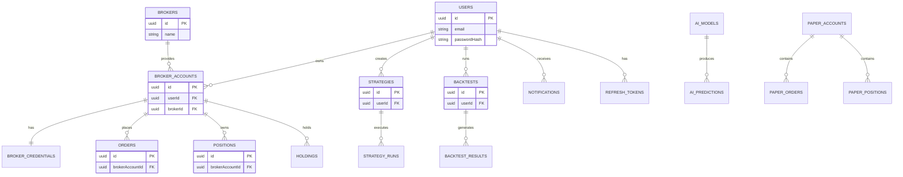

# AI Trading Platform - Entity Relationship Diagram

```mermaid
erDiagram

    USERS ||--o{ BROKER_ACCOUNTS : owns
    USERS ||--o{ STRATEGIES : creates
    USERS ||--o{ BACKTESTS : runs
    USERS ||--o{ NOTIFICATIONS : receives
    USERS ||--o{ REFRESH_TOKENS : has

    BROKERS ||--o{ BROKER_ACCOUNTS : provides
    BROKER_ACCOUNTS ||--|| BROKER_CREDENTIALS : has
    BROKER_ACCOUNTS ||--o{ ORDERS : places
    BROKER_ACCOUNTS ||--o{ POSITIONS : owns
    BROKER_ACCOUNTS ||--o{ HOLDINGS : holds

    STRATEGIES ||--o{ STRATEGY_RUNS : executes

    BACKTESTS ||--o{ BACKTEST_RESULTS : generates

    AI_MODELS ||--o{ AI_PREDICTIONS : produces

    PAPER_ACCOUNTS ||--o{ PAPER_ORDERS : contains
    PAPER_ACCOUNTS ||--o{ PAPER_POSITIONS : contains

    USERS {
        uuid id PK
        string email
        string passwordHash
    }

    BROKERS {
        uuid id PK
        string name
    }

    BROKER_ACCOUNTS {
        uuid id PK
        uuid userId FK
        uuid brokerId FK
    }

    ORDERS {
        uuid id PK
        uuid brokerAccountId FK
    }

    POSITIONS {
        uuid id PK
        uuid brokerAccountId FK
    }

    STRATEGIES {
        uuid id PK
        uuid userId FK
    }

    BACKTESTS {
        uuid id PK
        uuid userId FK
    }
```